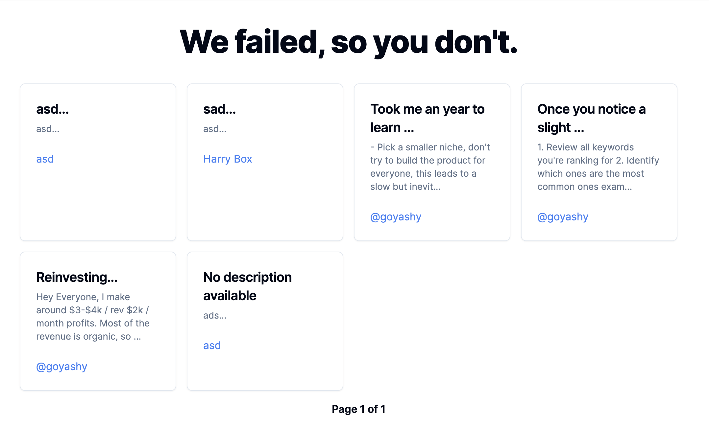
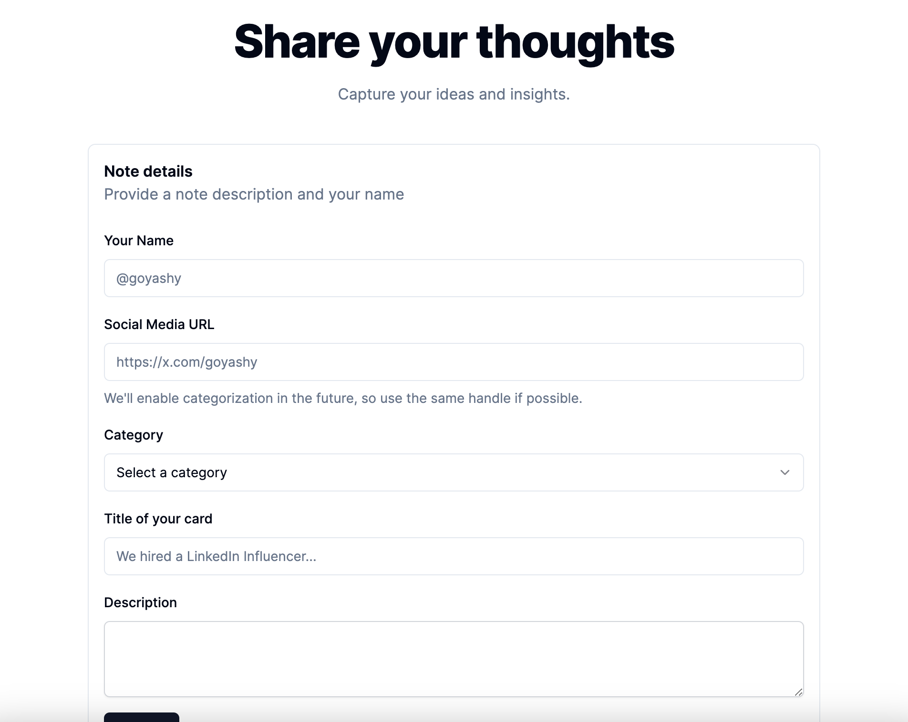

# Founder Notes Soloployee

Founder Notes Soloployee is a powerful web application built with Next.js 14 and the App Router, designed to help founders and solopreneurs efficiently document and learn from their failures. The application sources notes from founders all around the world, creating a global knowledge base of valuable insights and lessons learned.

## Features

- Intuitive and user-friendly interface for managing and sharing founder notes
- Global sourcing of notes from founders worldwide
- Efficient documentation of failures and lessons learned
- Seamless integration with PostgreSQL for data persistence
- Optimized for performance using Next.js 14 and the App Router
- Easy setup and deployment with Bun



## Prerequisites

- [Bun](https://bun.sh/) (latest version)
- [PostgreSQL](https://www.postgresql.org/) database

## Getting Started

1. Clone the repository:

```bash
   git clone https://github.com/whyashthakker/founder-notes-soloployee.git
```

2. Navigate to the project directory:
```bash
  cd founder-notes-soloployee
```

3. Install the dependencies using Bun:
```bash
    bun install
```

4. Set up the PostgreSQL database:

Create a new PostgreSQL database for the project
Update the database connection details in the .env file (see .env.example for reference)

5. Run the database migrations:
```bash
    bun run prisma migrate dev
```

6. Run the database migrations:
```bash
    bun run prisma migrate dev
```

Start the development server:
```bash
bun run dev
```

Open your browser and visit http://localhost:3000 to access the Founder Notes Soloployee application.

## Deployment
To deploy the Founder Notes Soloployee application to a production environment, follow these steps:

Build the optimized production-ready version of the application:
```bash
bun run build
```

Start the production server:
```bash
bun run start
```

Configure your web server or hosting platform to serve the application from the out directory.

## Contributing
Contributions are welcome! If you have any ideas, suggestions, or bug reports, please open an issue or submit a pull request. We encourage founders from all over the world to contribute their valuable insights and experiences to help build a comprehensive knowledge base of founder notes.

## License
This project is licensed under the MIT License.

## Acknowledgements
Next.js
Bun
PostgreSQL
Prisma